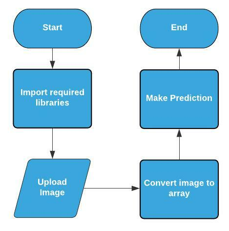

# UCS757 : Building Innovative Systems
# PROJECT 2 : Face Mask detection
## Introduction :

I have used CNN to differentiate between people wearing mask and people not wearing mask.
An accuracy of 98.2% on the training set and 97.3% on the test set is achieved.

I trained the model and used HDF5 file to store the model weights.

## Following are the libraries required: 
Python, Numpy,Pillow,Tensorflow

## Dataset Source :
https://data-flair.training/blogs/download-face-mask-data/

## Live Link :
https://nitish-mask-detection.herokuapp.com/

## Input Interface :

## Input Image :

## Output :

## Input Image :

## Output :

## Flowchart : 

## Submitted by :- 
### Nitish Jain
### 101803154
### COE8
